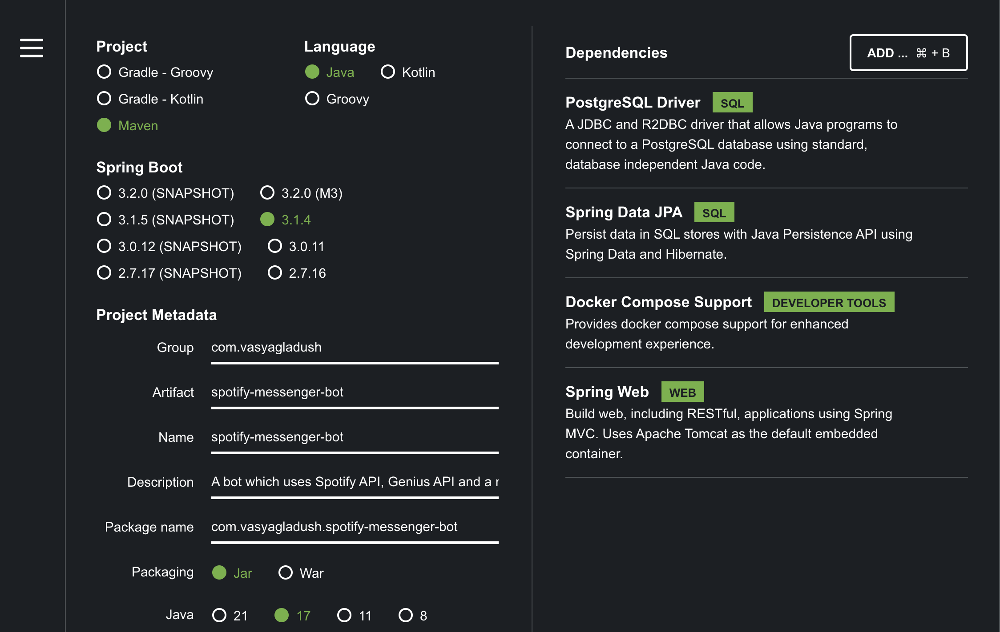

# spotify-messenger-bot

A bot which uses Spotify API, Genius API and a messenger platform API to send you the text of a song which is currently being played.

# Commands
- run command: `./mvnw spring-boot:run`

# [start.spring.io](https://start.spring.io) config

# Sources:
- **Postgres**: 
    - https://hackernoon.com/using-postgres-effectively-in-spring-boot-applications
    - https://www.baeldung.com/spring-boot-postgresql-docker
    - https://zetcode.com/springboot/postgresql/?utm_content=cmp-true